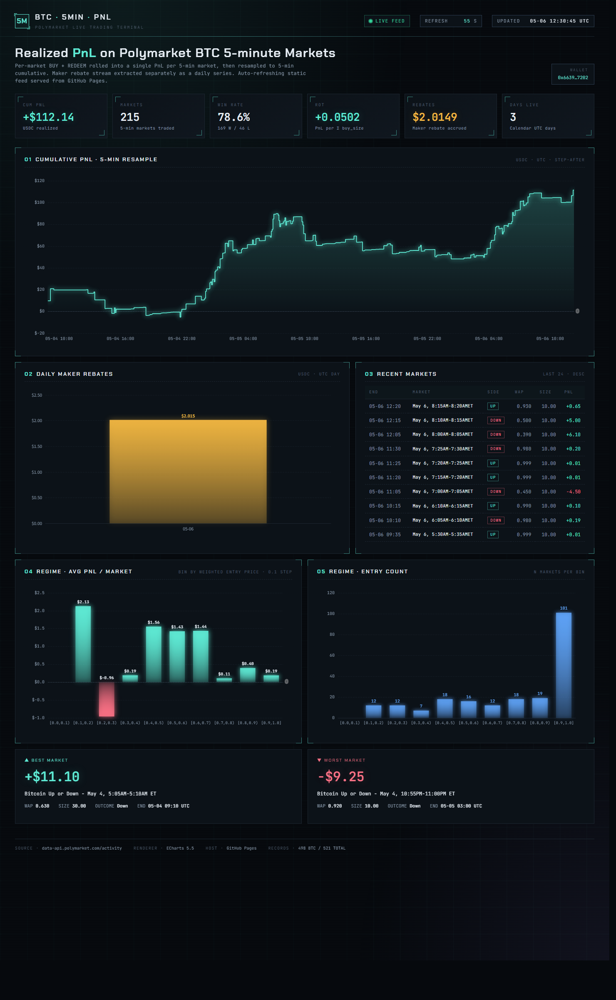

# BTC · 5MIN · LIVE PnL TERMINAL

Static, dark-mode "mission control" dashboard for a Polymarket BTC 5-minute
trading wallet. Refreshes itself via GitHub Actions cron every ~10 minutes;
the page silently re-fetches `data.json` every 60 seconds in the browser.



## Stack

- **Backend:** `calc_pnl.py` (Python) — pulls `data-api.polymarket.com/activity`,
  caches incrementally to `activity_cache.json`, emits `data.json`.
- **Frontend:** single static `index.html` + ECharts (loaded from CDN).
  No build step.
- **Hosting:** GitHub Pages serves the repo root.
- **Refresh:** `.github/workflows/refresh.yml` cron-schedules the data pull
  and commits the result back to `main`.

## Deploy in 5 minutes

1. **Create a new GitHub repo** (public for free Pages, or private + use
   Cloudflare Pages instead).
2. Push this folder as the repo root:
   ```bash
   git init
   git add .
   git commit -m "init"
   git branch -M main
   git remote add origin git@github.com:<you>/<repo>.git
   git push -u origin main
   ```
3. **Enable GitHub Pages**: repo → Settings → Pages → Source = "Deploy from a
   branch", branch = `main`, folder = `/` (root). Save.
4. **Allow Actions to commit**: repo → Settings → Actions → General →
   Workflow permissions → "Read and write permissions". Save.
5. Trigger the first run: Actions tab → "refresh-pnl" → "Run workflow".
   On completion, the dashboard is live at
   `https://<you>.github.io/<repo>/`.

## Configure the wallet

`ADDRESS` is hardcoded near the top of `calc_pnl.py`. To track a different
wallet, edit that constant. (Could be promoted to an env var if needed —
GitHub Actions injects repo variables into the runner env.)

## Local dev

```bash
pip install -r requirements.txt
python calc_pnl.py            # writes data.json
python -m http.server 8000    # browse http://localhost:8000/
```

## Refresh cadence

GitHub Actions cron has 5–15 min of real-world latency, so "every 10 minutes"
in the workflow yields a real refresh roughly every 10–20 min. The browser
re-fetches `data.json` every 60s, so the page itself feels live within that
backend cadence. Faster than that needs a real backend (Cloudflare Workers,
Vercel cron) — out of scope for static-site deploys.

## Files

| File | Role |
|---|---|
| `index.html` | Static dashboard, fetches `data.json` client-side |
| `calc_pnl.py` | One-shot data refresh entry point |
| `data.json` | Latest dashboard payload (regenerated each run) |
| `activity_cache.json` | Source of truth for raw API rows |
| `requirements.txt` | Python deps |
| `.github/workflows/refresh.yml` | Cron-driven refresh job |
| `EXPERIMENT_REPORT.md` | Build/design notes |

## Privacy note

The wallet address `0x6639…7202` is committed in `calc_pnl.py` and visible
to anyone reading the repo. The address is already public on-chain, so this
is "discoverability" rather than "leak" — but if you'd rather hide it, set
the repo private and host on Cloudflare Pages (free for private repos).
